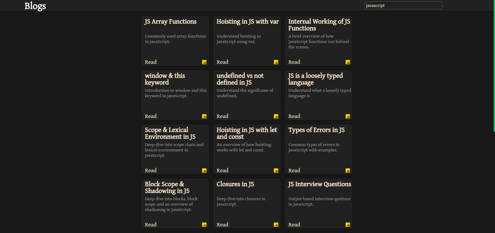

# Blogs

Website is built using React. React router is used for navigation, and framer motion for smooth page transitions. Read now at
    <a href="https://blogs-ssk.netlify.app/">blogs</a>

## Homepage

    

 

## Article View

    

 

## Search Functionality Enabled

    

 

## Topics

#### JS Array Functions

#### CSS Specificity

#### Git

#### Hoisting in JS with var

#### Internal Working of JS Functions

#### window and this keyword in JS

#### undefined vs not defined in JS

#### JS is a loosely typed language

#### Scope and Lexical Environment in JS

#### Hoisting in JS with let and const

#### Types of Errors in JS

#### Block Scope & Shadowing in JS

#### Closures in JS

#### JS Interview Questions

#### Commonly used jargons in JS

#### Callback Functions in JS

#### Event Loop in JS

#### Optioinal Chaining in JS

#### Nullish Coalescing Operator in JS

#### Factory and Constructor function in JS

#### Constructor property in JS

#### Primitive vs Reference type in JS

#### For-in & for-of loop in JS

#### Object Cloning in JS

#### Debounce & Throttle in JS
